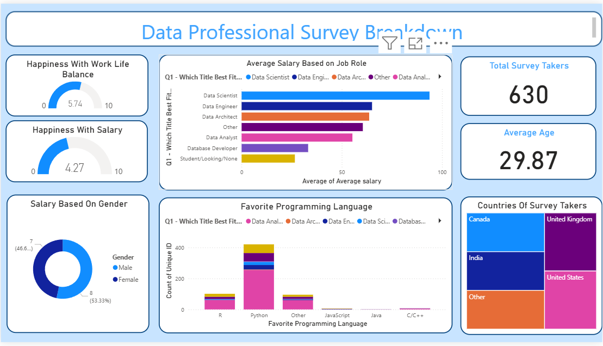

# 📊 Sales Dashboard - Power BI

## 📌 Project Overview

This Power BI dashboard provides an in-depth analysis of sales performance across regions, categories, and time periods.
It enables users to explore key business metrics such as revenue trends, customer segmentation, and product performance, helping drive data-informed decision-making.

## 🛠 Tools Used
**Power BI** – For building the interactive dashboard
**Excel/CSV** – Source dataset for sales data

## 📊 Key Metrics Displayed
**Total Sales**
**Total Profit**
**Quantity Sold**
**Top Customers**
**Top Products**
**Regional Performance**

## 📈 Dashboard Features
**Sales by Region** – Compare revenue across different locations
**Profit Trends** – Track profit growth over time
**Top Customers** – Identify the most valuable customers
**Top Products** – Highlight products contributing the most to sales
**Category-wise Sales** – Breakdown of sales by product categories
**Monthly & Yearly Trends** – Analyze sales performance over time

📸 Dashboard Preview

## 🔍 Insights
Identifies best-performing regions and categories
Highlights products contributing the most to profit
Tracks month-over-month sales growth patterns
Reveals customer segments driving revenue

📢 About This Project

*This project is part of my Data Analytics portfolio and demonstrates my ability to clean, analyze, and visualize business data using Power BI.*
